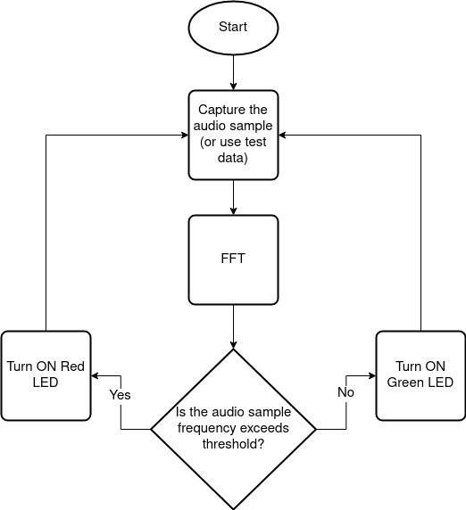
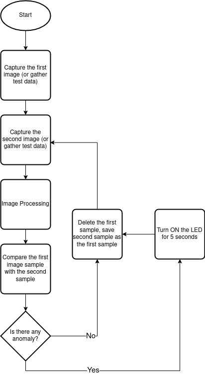

## Sensing Applications

Sense() -> Compute() -> Transmit()

### Application 1: Audio Sensing and Anomaly Detection

[]()

[link](https://www.instructables.com/MSP430-Breadboard-Audio-Spectrum-Analyser/)

1. Sample Audio.
2. Perform *FFT* (Time to Frequency)
3. Detect an event (anomaly): The frequency of the sample exceeds the threshold.
4. Send (raise a pin) it in 10 seconds or `Green (normal) Red (anomaly)`
6. Go to 1st step.

### Application 2: Motion Detection

[]()

[link](https://circuitdigest.com/microcontroller-projects/arduino-motion-detector-using-msp430-launchpad-and-pir-sensor)

1. Capture 1st Frame (RGB data format) 640x480 RGB array -> JPEG array
2. Hash frame 1 *SHA* (or *jpeg* encoder -compression-)
3. Capture 2nd Frame (RGB data format)
4. Hash frame 2 *SHA* (or *jpeg* encoder -compression-)
5. Compare hashes (or compare jpegs)
6. Transmit (if the anomaly detected, blink the LED twice)
7. Go to 1st step.

[jpeg-lib](https://github.com/richgel999/picojpeg)

## Security Applications

* data encryption, decryption and hashing algorithms

Receive() -> Compute() -> Transmit()

*RSA* asymmetric encryption (public/private key)
*AES* symmetric encryption (shared key)
*SHA* authentication
*CRC* Cyclic Redundancy Check (CRC)

message integrity checking associate a message integrity code (MIC) or other
hash-based message authentication code (HMAC) with the message

### Application 1: Authentication (Access control)

[link](https://www.ti.com/tool/SHA-256)
[link](https://www.ti.com/microcontrollers-mcus-processors/microcontrollers/msp430-micrcontrollers/applications.html)

```
SHA
Input: 512-bits Blocks   
Output: 256 bits hash
```

1. Receive the signal (when pushed a button send a random secret message from an
   array)
2. *SHA* (check the signature, if it is authentic, blink the LED)
3. Signal

### Application 2: Encrypted Communication

[link]()

1. Receive the signal
2. Analyze()
3. *AES* (Encrypt)
4. Transmit

### Application 3: Error Correcting of signed messages

[link]()

* Data being received is not corrupted during transfer. There is a need to check
  for communication errors in embedded systems.

1. Receive the message
2. *CRC* (checksum)
4. analyze the message
5. sign the signal
6. send the signal (blink LED)

## Benchmarks

[MiBench2](https://github.com/impedimentToProgress/MiBench2)
[EEMBC-TeleBench](https://www.eembc.org/telebench/)
[EEMBC-TeleBench](https://github.com/eembc/telebench)
[](https://www.eembc.org/techlit/datasheets/auto_fir.pdf)

**BASICMATH**: The basic math test performs simple mathematical calculations
that often don’t have dedicated hardware support in embedded processors. For
example, cubic function solving, integer square root and angle conversions from
degrees to radians are all necessary calculations for calculating road speed or
other vector values. The input data is a fixed set of constants.  
[link](https://github.com/impedimentToProgress/MiBench2/tree/master/basicmath)

**QSORT**: The qsort test sorts a large array of strings into ascending order
using the well known quick sort algorithm. Sorting of information is important
for systems so that priorities can be made, output can be better interpreted,
data can be organized, and the over- all run-time of programs reduced. The small
data set is a list of words; the large data set is a set of three-tuples
representing points of data.  
[link](https://github.com/impedimentToProgress/MiBench2/tree/master/qsort)
To calculate the median for a data sample of size n, sort the data and then:

* If n is odd: The middle value of the sorted data
* If n is even: The average of the middle two values of the sorted data

**SHA**: SHA is the secure hash algorithm that produces a 160-bit message digest
for a given input. It is often used in the secure exchange of cryptographic keys
and for generating digital signatures. It is also used in the well-known MD4 and
MD5 hashing functions. The input data sets are the same as the ones used by
blowfish.   
[link](https://github.com/impedimentToProgress/MiBench2/tree/master/sha)

**AES**: Rijndael was selected as the National Institute of Standards and
Technologies Advanced Encryption Standard (AES). It is a block cipher with the
option of 128-, 192-, and 256-bit keys and blocks. The input data sets are the
same as the ones used by blowfish.  
[link](https://github.com/impedimentToProgress/MiBench2/tree/master/aes)
There's a hardware support for RSA on MSP430FR5994 MCU
[link](https://www.ti.com/lit/an/slaa698b/slaa698b.pdf?ts=1612543823449)

**FFT**: This benchmark performs a Fast Fourier Transform and its inverse
transform on an array of data. Fourier's transforms are used in digital signal
processing to find the frequencies contained in a given input signal. The input
data is a polynomial function with pseudorandom amplitude and frequency
sinusoidal components.  
[link](https://github.com/impedimentToProgress/MiBench2/tree/master/fft)
[link](https://www.ti.com/lit/an/spra654/spra654.pdf)

**ADPCM encode/decode**: Adaptive Differential Pulse Code Modulation (ADPCM) is
a variation of the well-known standard Pulse Code Modulation (PCM). A common
implementation takes 16-bit linear PCM samples and converts them to 4-bit
samples, yielding a compression rate of 4:1. The input data are small and large
speech samples.  
[link](https://github.com/impedimentToProgress/MiBench2/tree/master/adpcm_decode)  
[link](https://github.com/impedimentToProgress/MiBench2/tree/master/adpcm_encode)

**jpeg encode/decode**: JPEG is a standard, lossy compression image format. It
is included in MiBench because it is a representative algorithm for image
compression and decompression and is commonly used to view images embedded in
documents. The input data are a large and small color image.  
[link]()

**CRC32**: This benchmark performs a 32-bit Cyclic Redundancy Check (CRC) on a
file. CRC checks are often used to detect errors in data transmission. The data
input is the sound files from the ADPCM benchmark.  
[link](https://github.com/impedimentToProgress/MiBench2/tree/master/crc)

## Application Development

[link](https://github.com/alanbarr/msp430-launchpad/tree/master/examples)

[link](https://github.com/bfirner/msp430-projects/tree/master/sample_code)

[link](http://mcuhq.com/11/msp430-launchpad-gui-composer-example)

[link](http://te.kmutnb.ac.th/~ptt/lectures/01_Microprocessors/03_MSP430/05_Tutorialv0_3.pdf)

* UART's communication would be good for testing.

[link](https://43oh.com/2010/08/10-beginner-msp430-tutorials-and-counting/)   
[link](http://jafari.tamu.edu/wp-content/uploads/2017/03/Tutorial-on-Embedded-Devices-rev0_1-v8.pdf)    
[link](http://www.ece.utep.edu/courses/web3376/MSP430_Labs.html)

## Energia

[link](https://circuitdigest.com/microcontroller-projects/getting-started-with-msp430G2-using-energia-ide-blinking-an-led)

### Security Application Notes

**Low-level security (hashing only, plaintext data) applications** delivering
publicly available information such as stock market data, data monitoring,
networked applications in a controlled environment, and applications requiring
an extra level of robustness without concern about eavesdropping. Another
example of this would be the distribution of (usually open-source) source code
or executables with an accompanying hash value for verifying integrity, usually
an MD5 or SHA-1 hash of the files that is to be calculated by the end user and
compared to the provided hash.

**Medium-level security (cryptography such as RC4 with authentication, small key
sizes) applications** dealing with general corporate information, important data
monitoring, and industrial control in uncontrolled environments.

**Medium-high security (SSL with medium key sizes, RSA and AES, VPNs)
applications** dealing with e-commerce transactions, important corporate
information, and critical data monitoring.

**High-level security (SSL with maximum-sized keys, VPNs, guards with guns)
applications** dealing with important financial information, noncritical
military communications, medical data, and critical corporate information.

**Critical-level security (physical isolation, maximum-size keys, dedicated
communications systems, one-time pads, guards with really big guns)** used to
secure information such as nuclear launch codes, root Certificate Authority
private keys (hopefully!), critical financial data, and critical military
communications.

**Absolute security (one-time pads, possibly quantum cryptography, guards with
an entire military behind them)** used to secure information including Cold War
communications between the United States and the Soviet Union regarding nuclear
weapons, the existence of UFOs, the recipe for Coca-Cola, and the meaning of
life.

